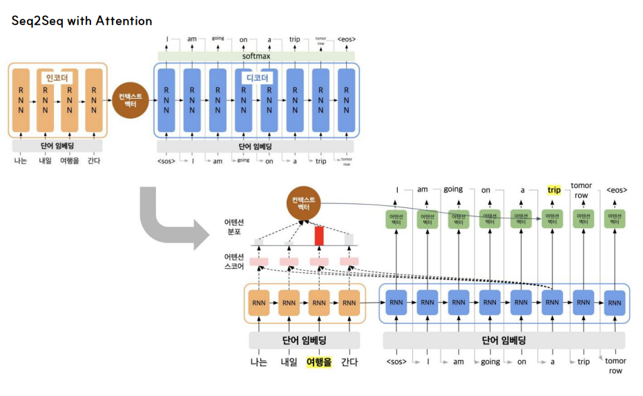

# 261007 학습내용

## NLP - ELMo, Seq2Seq

### 1. ELMo

 (1) ELMo (Embeddings from Language Model)

 - ELMo (Embeddings from Language Model)는 Allen NLP에서 2018년에 발표한 **문맥적 워드 임베딩(Contextualized Word Embedding)**
 - ELMo는 세서미 스트리트라는 미국인 형극의 캐릭터
 - 사전 훈련된 언어 모델(Pre-trained language model)을 사용
 - 기계번역, 언어모델링, 텍스트요약, 개체명인식, 질문-답변시스템 등
    * ELMo는 전통적단어 임베딩 방식(Word2Vec, FastText, GloVe 등)에서 문맥적 해석방식을 추가하여, 하나의 단어에 대해서 문맥에 따라 다른 의미로 임베딩

 (2) ELMo 구조

 - RNN으로 단어를 예측하는 것은 문맥을 고려한 단어 예측
 - ELMo는 순방향(다음단어) / 역방향(이전단어)으로 예측하는 biLM으로 사전훈련

 - ELMo의 구조는 기본적으로 양방향 언어 모델(biLM, Bidirectional Language Model)을 기반
 - 3개의 계층(Layer) 축
    * 글자 단위 입력층 (Char CNN): 단어(Word) 단위가 아니라 글자(Character) 단위로 학습합니다. 덕분에 unbelievable처럼 사전에 없는 새로운 단어(OOV, Out-of-Vocabulary)가 들어와도 형태학적 유사성을 파악해 벡터를 만들어낼 수 있습니다.
    * 순방향 LSTM 레이어 (Forward LSTM): 문장을 왼쪽에서 오른쪽으로 읽으며 다음 단어를 예측하는 방향으로 문맥을 학습
    * 역방향 LSTM 레이어 (Backward LSTM): 문장을 오른쪽에서 왼쪽으로 읽으며 이전 단어를 예측하는 방향으로 문맥을 학습
 - 일반적으로 ELMo는 이 LSTM 레이어를 2개 층(Deep LSTM)으로 쌓아서 총 3개 층(입력 1개 + LSTM 2개)의 임베딩 결과를 만들어 냅니다.

 (3) ELMo 사전학습과 활용

 -  ELMo는 “언어모델 사전학습"과 “자연어처리 Task 적용“ 2단계로 수행
 - 언어 모델 사전 학습(biLM 사전학습) :  Bidirectional LSTM으로 언어모델 사전 학습
 -> 자연어처리 태스크 적용 (ELMo 표현) :  "단어 임베딩 + 중간 단어 임베딩”의 가중합으로 ELMo 표현. 자연어처리 태스크에 적용하여 가중치 학습

 (4) biLM(Bidirectional Language Model)의 사전 훈련

 - LSTM의 경우 순방향은 다음 단어를 역방향은 이전 단어를 예측
 - 양방향의 컨텍스트를 포함하여 단어를 예측하여 학습

 (5) char CNN

 - ELMo 입력 단어의 임베딩 방법으로 char CNN을 사용
 - 글자(character) 단위로 CNN을 적용하여 임베딩 함으로써, 문맥과 상관없이 단어 안에 포함된 서브 단어(subword)도 임베딩 가능
 - OOV(Out of Vocabulary)에 견고
 - 글자 단위로 함으로써 한국어, 일본어에도 적용 가능

 (6) ELMo representation

 - 1단계 : char CNN 단어임베딩 출력값(=단어 벡터 출력)(1), 레이버별 순방향, 역방향 레이어(2,3) 출력값을 연결(=중간 단어벡터 출력) (concat 연산, 길이 맞춤)
    * 중간 단어벡터는 다음 레이어의 입력으로 사용
 - 2단계 : 출력값들 가중합(=최종 단어벡터 출력) => 3가지를 하나로 합침 (task별 학습)
 - 3단계 : 합친 값 스케일 조정하여 ELMo 표현 (task에 적용) 

 (7) stacking 효과

 - 레이어 별 중간 벡터를 반영하여 단어의 의미적(Semantic), 문법적(Syntactic) 부분을 함께 고려
 - 문법적 요소는 초기 레이어쪽에, 의미적 요소는 깊은 레이어쪽에 존재
 - 레이어가 깊어질수록 의미적 요소 파악에 유리

 (8) NLP task 적용

 - ELMo표현을 NLP Task에 적용할때는 “기존 임베딩 + ELMo 표현"을 입력값으로 사용하여 적용

 - 대량 corpus를 biLM으로 사전학습
 - 학습한 값을 실제 값에 입력

### 2. Seq2Seq

 (1) Seq2Seq 

 - RNN 활용 중 many to many(입력:출력 = N:M) 방식
 - encoder(context vector 도출), decoder(context vector로부터 예측) 활용
 - encoder : 단어 임베딩한 입력 시퀀스(여러개)가 RNN 모델로 단일 컨텍스트벡터(문맥벡터)로 인코딩 됨
 - decoder : 단일 컨텍스트벡터 입력 후 RNN 모델로 시퀀스(여러개) 출력(softmax 방식으로 확률분포 계산). 최대 확률을 가진 단어로 변환하여 결과 출력 
 - 기계번역 등에서 사용

 (2) 학습 - teacher forcing

 - 중간에 틀린답을 예측했더라도 다음 진행 시 정답을 입력값에 넣어 지속 학습시킴
 - 그 뒤, 처음 인코더까지 역전파 학습 진행
 - RNN이 많아지면, 기울기 소실/기울기 폭발 문제 발생 가능 

 
### 3. Seq2Seq with attention

 (1) Seq2Seq의 문제
 - 입력 시퀀스의 길이에 상관없이 단일 컨텍스트 벡터로 표현하여 정보 병목(Information Bottleneck) 현상이 발생

 (2) Attention Mechanism
 - 디코더에서 예측시 인코더에서 집중(Attention)할 정보를 더 고려하여 예측

 ##### (3) 🧠 어텐션 메커니즘 (Attention Mechanism) 단계별 개념 정리

    어텐션 메커니즘은 디코더가 다음 단어를 예측할 때, 인코더의 입력 문장 중 **"지금 타이밍에 어떤 단어에 얼마나 집중(Attention)해야 하는지"**를 스스로 찾아내는 기술입니다.

    ---

    어텐션 작동 5단계 프로세스

    1단계. 디코더의 질문: 쿼리 (Query)

        * **개념**: 현재 시점에서 디코더 RNN이 가지고 있는 **숨겨진 상태(Hidden State)**입니다.
        * **쉽게 이해하기**: 디코더가 지금까지 번역해온 문맥을 바탕으로 인코더에게 던지는 질문지입니다. 
        > 💬 *"나 방금 전까지 '나는 ~에 갈 예정이다'라고 말했어. 이제 목적지가 나올 차례인데, 입력 문장에서 뭘 집중해서 봐야 하지?"*

        ---

    2단계. 유사도 결합: 어텐션 스코어 (Attention Score)
        * **개념**: 디코더의 질문(Query)과 인코더의 모든 단어 정보(Key)를 **결합(Concat) 연산하여 얼마나 연관성이 높은지 점수**를 매기는 단계입니다.
        * **핵심 메커니즘**: 
          컴퓨터는 단어의 의미를 '벡터(숫자 배열)'로 이해합니다. 두 벡터의 유사도를 구하기 위해 **디코더의 현재 상태 벡터와 인코더의 각 단어 벡터를 옆으로 나란히 이어 붙인(Concat) 후, 신경망(Linear/RNN 층)에 통과**시킵니다.
          > 🤝 *"너네 둘이 얼마나 친해? 친한 만큼 점수 내놔!"* 하고 각 단어별 친밀도 점수(예: 12점, -3점, 85점)를 뽑아냅니다.

    ---

    3단계. 주의력 지도 생성: 어텐션 분포 (Attention Weights)
        * **개념**: 2단계에서 구한 들쭉날쭉한 점수들을 **Softmax(소프트맥스) 함수**에 통과시켜 **0~1 사이의 확률값(총합=1)**으로 이쁘게 정규화한 지도입니다.
        * **쉽게 이해하기**: 점수가 가장 높았던 단어는 높은 확률로 치솟고, 관련 없는 단어는 0%에 수렴하게 됩니다.
          > 🗺️ *"'여행을'이라는 단어의 확률이 95%로 집중되어 있네! 지금 타이밍엔 다른 단어 보지 말고 **여기를 95% 확률로 집중해!**" 하고 컴퓨터에게 알려주는 영리한 지도가 완성됩니다.*

    ---

    4단계. 알짜배기 압축: 컨텍스트 벡터 (Context Vector)
        * **개념**: 3단계에서 구한 확률(가중치)을 인코더의 단어 정보에 곱한 뒤 모두 더하는 **가중합(Weighted Sum)** 단계입니다.
        * **쉽게 이해하기**: 중요한 단어의 정보는 진하게, 관련 없는 단어의 정보는 연하게 반영하여 단 하나의 벡터로 합칩니다.
          > 🧪 *입력 문장 전체 중에서 지금 디코더에게 꼭 필요한 **'여행을'의 의미만 아주 진하게 추출해낸 엑기스 에센스 한 방울**이 만들어집니다.*

    ---

    5단계. 최종 융합 및 예측: 아웃풋 (Output)
        * **개념**: 디코더의 원래 기억과 방금 도착한 에센스(Context Vector)를 **최종적으로 융합하여 출력층(Linear)으로 전달**하는 단계입니다.
        * **쉽게 이해하기**: 디코더가 양손에 강력한 무기를 쥐게 됩니다.
          1. ✋ 왼손: "내 흐름상 다음엔 목적지 단어가 와야 해" (디코더 자체 정보)
          2. ✊ 오른손: "인코더에서 찾아온 가장 알맞은 목적지 뜻은 '여행'이야" (어텐션 에센스)
          > 🎯 두 정보를 강력하게 결합하여, 번역기 컴퓨터는 오차 없이 정확하게 **`trip`**이라는 단어를 화면에 출력하게 됩니다.

    ---

📊 한눈에 보는 요약 표

| 단계 | 주요 역할 | 핵심 연산 / 기술 | 비유 |
| :---: | :--- | :--- | :--- |
| **1단계** | **질문 던지기** | 디코더 Hidden State (\(s_t\)) | *"나 지금 이런 정보가 필요해"* |
| **2단계** | **유사도 계산** | **Concat (옆으로 붙이기)** + Linear 연산 | 두 정보를 풀로 붙여 친밀도 점수 매기기 |
| **3단계** | **확률 지도 만들기** | **Softmax (소프트맥스)** | 중요 단어만 높게 치솟는 확률 그래프 생성 |
| **4단계** | **핵심 정보 압축** | 가중합 (Weighted Sum) | 필요한 단어 뜻만 쏙 뽑아낸 엑기스 에센스 |
| **5단계** | **최종 번역** | 디코더 정보 + 컨텍스트 벡터 결합 | 두 무기를 합쳐서 정확한 단어(`trip`) 출력 |

\

### 4. NLP - Transformer

 (1) 트랜스포머

 - Convolution(합성곱), Recurrence(순환신경망) 모두 사용 안함
 - 장기의존성 문제해결 > 어떤 정보와 다른 정보 사이의 거리가 멀 때 해당 정보를 이용하지 못하는 것을 Attention mechanism으로 해결
 - RNN을 사용하지 않고 행렬 병렬연산( Parallelization )으로 빠르게 학습이 가능

 (2) 개념
 - 예. encoder 6개 레이어, decoder 6개 레이어 -> 인코딩 6번 반복 작업한 결과가 모든 디코더에 똑같이 입력됨 

    1. 인코더 부분

        - Inputs & Input Embedding (입력 & 입력 임베딩)
            - 사람이 쓰는 단어를 컴퓨터가 이해할 수 있는 '숫자 배열(벡터)'로 바꾸는 방

        - Positional Encoding (포지셔널 인코딩)
            - 단어의 '위치 정보(순서)'를 숫자로 더해주는 단계
            - "이 단어는 문장의 1번째 단어야", "이건 2번째 단어야"라는 위치 신호(주파수 형태의 값)를 임베딩 데이터에 살짝 더해주는(= 모양의 기호) 과정

        - Multi-Head Attention (멀티 헤드 어텐션)
            - 문장 안의 단어들이 서로 어떤 연관성이 있는지 여러 개의 눈(Head)으로 동시에 분석
            - Seq2Seq 어텐션은 디코더가 인코더를 바라봤지만, 여기서는 인코더 스스로(Self) 입력된 문장 안에서 단어 간의 관계를 찾아냄

        - Add & Norm (잔차 연결 및 계층 정규화)
            - 데이터가 신경망을 지나면서 원래 정보가 왜곡되거나 소실되는 것을 막고, 값을 안정적으로 다듬어주는 안전장치
        
        - Feed Forward (피드 포워드 신경망)
            - 단어별로 독립적인 추가 연산(Linear 층)을 처리하여 데이터의 특징을 더 깊게 추출하는 곳
            - 각 단어 자체의 의미적 깊이를 더해주는 개별 과외 시간입니다. 모든 단어에 동일한 수학 공식(신경망)을 적용해 데이터를 한 단계 더 업그레이드

        - Nx (블록 반복)
            -  박스(인코더 블록)를 N번만큼 위로 쌓아서 반복한다는 뜻(보통 기본 트랜스포머는 6번 쌓습니다.)

    2. 디코더 부분

        - Outputs (shifted right) & Output Embedding
            - 디코더가 지금까지 예측해서 뱉어낸 단어들을 숫자로 바꾸는 방

        - Positional Encoding (포지셔널 인코딩)
            - 디코더에 들어오는 단어들에게도 "이 단어는 내가 방금 첫 번째로 뱉은 단어야", "이건 두 번째 단어야" 하고 순서 정보를 더해줌

        - Masked Multi-Head Attention (마스크드 멀티 헤드 어텐션)
            - 정답을 예측할 때 미래의 단어를 미리 컨닝하지 못하도록 가림막(Mask)을 치고 수행하는 셀프 어텐션
            - 현재 단어 기준으로 뒤에 나오는 미래의 단어들은 수학적으로 마스킹(0점 처리)하여 가려버린 채, 오직 내가 과거에 했던 말들 안에서만 연관성을 찾게 만듭니다

        - Multi-Head Attention (멀티 헤드 어텐션 / 인코더-디코더 어텐션)
            - 인코더가 공부해서 넘겨준 정보와 내가 방금 마스크드 어텐션으로 정리한 정보를 결합하는 핵심 장소
            - 인코더가 입력한 문장을 분석해둔 것 + 디코더가 입력한 현재 상태(질문)

        - Feed Forward ➔ Add & Norm
            - 결합된 데이터를 바탕으로 개별 단어의 의미적 특징을 더 깊게 연산(Feed Forward)하고, 정보가 망가지지 않게 원본을 더하고 이쁘게 다듬어줍니다(Add & Norm). 이 디코더 블록도 Nx 횟수만큼(보통 6번) 위로 쌓아 올리며 반복 학습합니다.

        - Linear & Softmax (최종 출력)
            - 완성된 고차원 숫자를 우리가 아는 단어의 확률로 바꾸어 최종 단어를 뱉는 출구

 (3) Self-attention (셀프 어텐션)   (기능)

 - 문장 속 단어들이 서로 어떤 연관성이 있는지 스스로 계산하여 전체 맥락을 입체적으로 파악하는 기술

 - **연산 Dependency 가 줄어 빠른 연산 가능**
    - 셀프 어텐션은 문장 전체 단어들의 관계를 한 번에(동시에) 행렬 계산으로 끝내버립니다. 덕분에 컴퓨터(GPU)가 엄청나게 빠른 속도로 처리할 수 있습니다. (병렬화 가능 연산 증가)
 - **long-range의 term들의 dependency(장기의존성)도 학습가능**
    - 첫 번째 단어와 100번째 단어도 단 한 번의 화살표(연산)로 **직접 다리를 놓아 연결**하기 때문에, 아무리 문장이 길어져도 맥락을 완벽하게 기억합니다.
    * 스케일을 조정해 주는 이유는 내적 행렬의 분산을 줄여 개별 softmax 값이 지나치게 작아지는 문제를 방지
 - **결과에 대한 해석과 설명이 가능 (Explainable AI)**
    - 단어와 단어 사이에 어떤 선이 가장 굵게 연결되었는지 시각적으로 확인할 수 있습니다. 덕분에 번역기가 왜 이런 결과를 냈는지 컴퓨터의 속마음(어텐션 학습 결과)을 인간이 직관적으로 이해하고 설명할 수 있습니다.

 (4) Scaled Dot-Product Attention   (기능구현을 위한 수학적 계산 방법)

 - 셀프 어텐션을 하려면 각각 역할이 다른 Query(질문), Key(대상), Value(내용) 필요
 - 단어 벡터 행렬에 각각 성격이 다른 가중치 행렬을 곱해 쿼리(Q), 키(K), 벨류(V) 벡터 행렬로 새롭게 생성
 - 계산과정

    1.  MatMul (곱하기) ➔ 단어 간 유사도 구하기
        - '여행을'의 **쿼리 벡터**와 문장 속 모든 단어들의 **키 벡터**({나는}, {내일}, {여행을}, {간다})를 각각 행렬 곱셈(MatMul)
        - 각각 Attention score 도출
        - 두 벡터를 곱해서 나온 결과(예: 4, 2, 8, 8)는 단어들끼리 얼마나 친한지 나타내는 원시 점수

    2. Scale (나누기) ➔ 점수 조절하기
        - 방금 구한 점수들을 $\sqrt{d_k}$로 나누어 줍니다
        - 차원($d_{k}$)이 커질수록 곱셈 결과(점수)가 너무 커져서 뒤에 나올 Softmax 함수가 제대로 작동하지 못하고 먹통(기울기 소실)이 됩니다. 이를 방지하기 위해 값을 얌전하게 깎아주는 조절(Scale) 단계입니다. 이 결과물이 바로 Attention Score입니다.

    3. Softmax (소프트맥스) ➔ 확률 지도로 바꾸기
        - 조절된 점수(2, 1, 4, 4)를 Softmax 함수에 집어넣습니다.
        - 들쭉날쭉하던 점수들이 총합이 1(100%)이 되는 이쁜 확률값(6.2%, 2.3%, 45.8%, 45.8%)으로 바뀝니다. 이게 바로 Attention Distribution(어텐션 분포/가중치)입니다.

    4. MatMul (벨류 곱하기) ➔ 알짜배기 정보 추출
        - 방금 구한 확률(6.2%, 45.8% 등)을 처음에 만들어 둔 진짜 알짜배기 정보인 벨류($V$, 초록색 벡터)에 각각 곱해줍니다
        - 중요도가 낮은 '내일'의 벨류$(V_{\text{내일}})$는 색이 아주 연해지고(2.3%만 반영), 중요한 '여행을'과 '간다'의 벨류는 진하게 살아남은 Attention Value들이 만들어집니다.

    5. Sum (더하기) ➔ 최종 어텐션 벡터 완성
        - 진함과 연함이 조절된 초록색 벡터들을 모두 하나로 더해줍니다
        - 문장의 모든 맥락이 영리하게 압축된 단 하나의 Attention Vector가 탄생합니다. 이 벡터는 이제 다음 방인 'Feed Forward' 신경망으로 올라가게 됩니다.

 (5) Multi-Head attention

 - 하나의 어텐션 메커니즘을 여러 개(헤드 개수만큼) 병렬로 적용하여, 문장 속 단어들의 관계를 다양한 관점에서 포착하는 기술

 - 계산과정

    1. 입력: 단어 벡터 행렬 $(k * d_{\text{model}})$
        - 각 단어는 모델 차원수인 n차원 벡터로 표현됩니다. 입력 행렬의 크기는 $(k * d_{\text{model}})$가 됩니다.

    2. 가중치 곱과 선형 변환 (헤드별 분할)
        - 이 입력 행렬이 하나의 관점으로만 학습되지 않도록, 여러 개의 헤드(여기서는 헤드 수 \(h=8\))로 쪼개어 독립적인 어텐션을 수행합니다.
        - 쿼리, 키, 밸류 가중치 행렬 $(d_{\text{model}} * d_q)$: 각 헤드는 고유한 가중치 행렬$((W^Q, W^K, W^V))$을 가집니다.

    3. 싱글 헤드 어텐션 수행
        - 각 헤드는 생성된 \(Q, K, V\) 행렬을 사용해 독립적으로 스케일드 닷-프로덕트 어텐션(Scaled Dot-Product Attention)을 계산합니다.

    4. 어텐션 결과 결합 (Concatenate)
        - 병렬로 계산된 헤드의 결과물들을 옆으로 길게 이어 붙입니다(Concat)
        - $(k * hd_v)$ 크기의 거대한 하나의 행렬이 완성

    5. 최종 가중치 행렬 곱과 출력 $((k * d_{\text{model}})$
        - 결합된 행렬에 마지막으로 멀티 헤드 어텐션 가중치 행렬 $((W^{O})$, 크기: $(hd_v * d_{\text{model}})$ 을 곱해줍니다.
        - 이 과정을 통해 차원이 다시 처음 입력되었을 때와 똑같은 $(k * d_{\text{model}})$ 크기로 압축되며, "나는 내일"에 대한 최종 어텐션 행렬이 완성됩니다.
